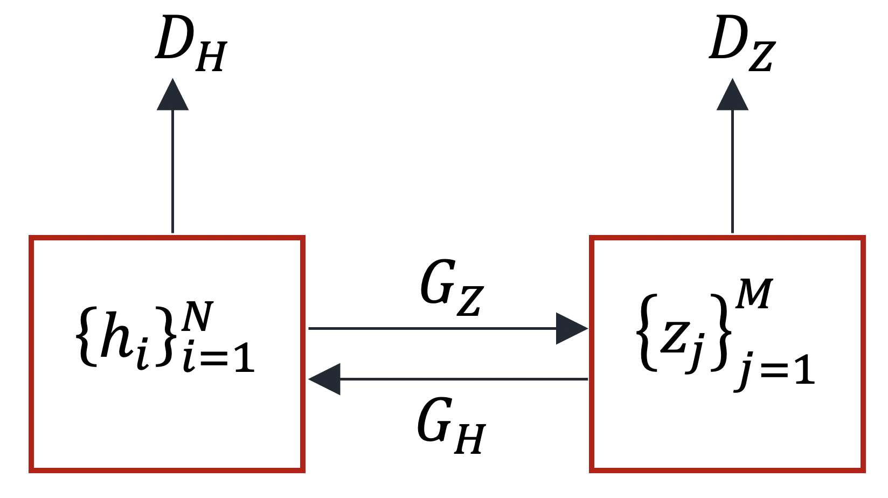

# Image-Translation-with-CycleGAN

Translating images from one domain to another domain with CycleGAN

# Dataset

<ul>
    <li>
        Dataset:
        <ul>
            <li>
                <a href="https://www.kaggle.com/datasets/balraj98/horse2zebra-dataset">Horse2zebra Dataset</a>
                <ul>
                    <li>
                        Download it to <code>"./datasets/Horse2Zebra"</code>
                    </li>
                </ul>
            </li>
        </ul>
    </li>
</ul>

# Data Preprocessing

<ul>
    <li>
    Preprocessing Data:
        <ul>
            <li>
                <code>cd "./datasets/Horse2Zebra"</code>
            </li>
            <li>
                <code>python preprocess.py</code>
            </li>
        </ul>
    </li>
    <li>
    Spliting Data:
        <ul>
            <li>Dataset was splitted into training, validation, and testing set.</li>
        </ul>
    </li>
</ul>

<table style="text-align: center margin-left: auto; margin-right: auto; text-align: center" border=0 align=center>
    <thead>
        <tr>
            <th style="border-bottom-style: none"></th>
            <th colspan=2 style="text-align: center"># of Data</th>
        </tr>
        <tr>
            <th></th>
            <th>Horse Domain</th>
            <th>Zebra Domain</th>
        </tr>
    </thead>
    <tbody>
        <tr>
            <td>Training</td>
            <td>853</td>
            <td>1067</td>
        </tr>
        <tr>
            <td>Validation</td>
            <td>214</td>
            <td>267</td>
        </tr>
        <tr>
            <td>Testing</td>
            <td>120</td>
            <td>140</td>
        </tr>
    </tbody>
</table>

<ul>
    <li>
        Network Input:
        <ul>
            <li>
                Input Size:
                <ul>
                    <li>
                        128x128
                    </li>
                </ul>
            </li>
            <li>
                Normalization:
                <ul>
                    <li>μ = [0.5,0.5,0.5]</li>
                    <li>σ = [0.5,0.5,0.5]</li>
                </ul>
            </li>
        </ul>
    </li>
</ul>

# CycleGAN

<ul>
    <li>
        Two Generators:
        <ul>
            <li>
                GH: Zebra → Horse
                <ul>
                    <li>
                        This function translate a zebra image to a horse image.
                    </li>
                </ul>
            </li>
            <li>
                GZ: Horse → Zebra
                <ul>
                    <li>
                        This function translate a horse image to a zebra image.
                    </li>
                </ul>
            </li>
        </ul>
    </li>
    <li>
        Two Discriminator:
        <ul>
            <li>
                DH
                <ul>
                    <li>
                        This function specifies that the input data is from a real or fake horse domain.
                    </li>
                </ul>
            </li>
            <li>
                DZ
                <ul>
                    <li>
                        This function specifies that the input data is from a real or fake zebra domain.
                    </li>
                </ul>
            </li>
        </ul>
    </li>
    <li>
        Replay Buffer:
        <ul>
            <li><strong>To prevent model oscillation</strong>, a module called Replay Buffer was used in training of discriminators. This module add generated image to a buffer and returns this added image with a probability of 50%, otherwise it returns one of the buffered images.</li>
        </ul>
    </li>
</ul>

<table style="text-align: center margin-left: auto; margin-right: auto; text-align: center" border=0 align=center>
    <tbody>
        <tr>
            <td>
                
            </td>
        </tr>
    </tbody>
</table>

# Loss Function

The loss function of CycleGAN is made up of several parts, which will be examined first in each of these parts
and then obtain the final loss function.

<ul>
    <li>
        <strong>Adversarial Loss:</strong>
        <ul>
            <li>
                <strong>Hores Generator & Discriminator:</strong> Using this funciton, the error value of detecting whether the horse data is real or fake is calculated.
            </li>
        </ul>
    </li>
</ul>

$‌$ \ell _{GAN}(G_{H},D_{H},H,Z) = \mathbb{E}_{{h}\sim{p_{data}{(h)}}} {[\log{D_{H}{(h)}}]} + \mathbb{E}_{{z}\sim{p_{data}{(z)}}} {[\log ({1-D_{H}({G_{Z}(Z)})})]} $$

<ul style="list-style-type: none">
    <li>
        <ul>
            <li>
                <strong>Zebra Generator & Discriminator:</strong> this loss fuction calculates the of amount of error of misclassifying data from zebra domain as fake or real.
            </li>
        </ul>
    </li>
</ul>

$‌$ \ell _{GAN}(G_{Z},D_{Z},H,Z) = \mathbb{E}_{{z}\sim{p_{data}{(z)}}} {[\log{D_{Z}{(z)}}]} + \mathbb{E}_{{h}\sim{p_{data}{(h)}}}  $$

<ul>
    <li>
        <strong>Cycle Consistency Loss:</strong> This loss function tries to make the two functions GH and GZ to be inverse of each other.
    </li>
</ul>

$‌$ \ell _{cyc}(G_H, G_Z, H, Z) = \mathbb{E}_{{h}\sim{p_{data}{(h)}}} {( \| G_{H}(G_{Z}(H)) - h \|_{1} )} + \mathbb{E}_{{z}\sim{p_{data}{(z)}}} {( \| G_{Z}(G_{H}(Z)) - z \|_{1} )} $$

<ul>
    <li>
        <strong>Identity Loss:</strong> This loss function is used when the generated data should not lose its identity.
    </li>
</ul>

$‌$ \ell _{identity}(G_H, G_Z, H, Z) = \mathbb{E}_{{h}\sim{p_{data}{(h)}}} {( \| G_{H}(h) - h \|_{1} )} + \mathbb{E}_{{z}\sim{p_{data}{(z)}}} {( \| G_{Z}(z) - z \|_{1} )} $$

The total loss function is as follow:

$‌$ \ell (G_H, G_Z, D_H, D_Z, H, Z) = \ell _{GAN}(G_{H},D_{H},H,Z) + \ell _{GAN}(G_{Z},D_{Z},H,Z) + \lambda _{cyc} \ell _{cyc}(G_H, G_Z, H, Z) + \lambda _{identity} \ell _{identity}(G_H, G_Z, H, Z) $$

The two $ G_H $ and $ G_Z $ mappings are obtained as follows:

$$ G_H, G_Z= \underset{G_H, G_Z}{\arg\min}{ \underset{D_H, D_Z}{\max}{\ell (G_H, G_Z, D_H, D_Z, H, Z)} } $$
