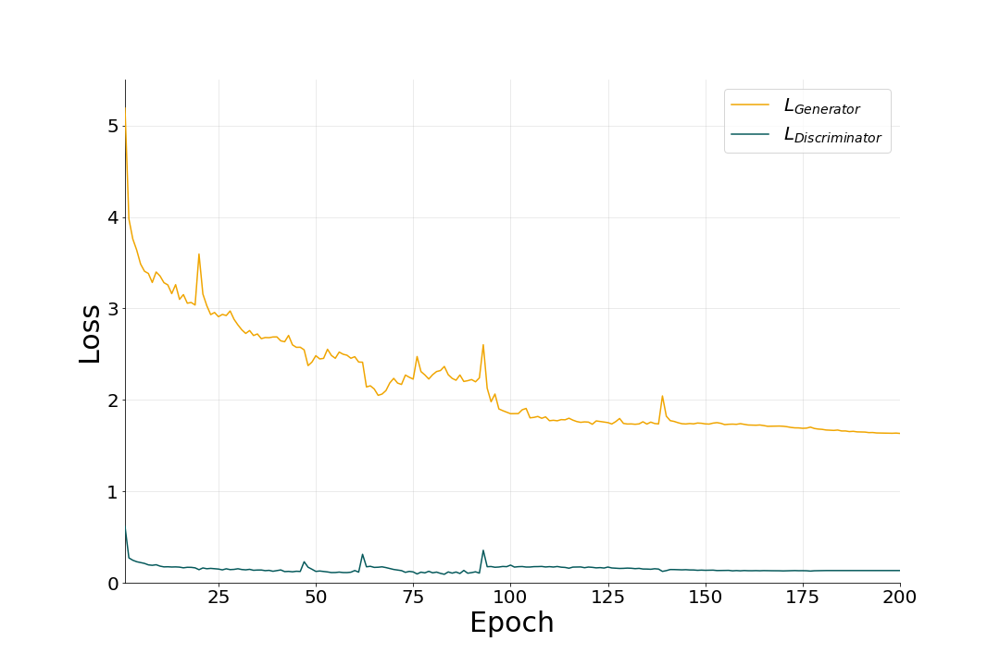

# Image-Translation-with-CycleGAN

Translating images from one domain to another domain with CycleGAN

# Dataset

<ul>
    <li>
        Dataset:
        <ul>
            <li>
                <a href="https://www.kaggle.com/datasets/balraj98/horse2zebra-dataset">Horse2zebra Dataset</a>
                <ul>
                    <li>
                        Download it to <code>"./datasets/Horse2Zebra"</code>
                    </li>
                </ul>
            </li>
        </ul>
    </li>
</ul>

# Data Preprocessing

<ul>
    <li>
    Preprocessing Data:
        <ul>
            <li>
                <code>cd "./datasets/Horse2Zebra"</code>
            </li>
            <li>
                <code>python preprocess.py</code>
            </li>
        </ul>
    </li>
    <li>
    Spliting Data:
        <ul>
            <li>Dataset was splitted into training, validation, and testing set.</li>
        </ul>
    </li>
</ul>

<table style="text-align: center margin-left: auto; margin-right: auto; text-align: center" border=0 align=center>
    <thead>
        <tr>
            <th style="border-bottom-style: none"></th>
            <th colspan=2 style="text-align: center"># of Data</th>
        </tr>
        <tr>
            <th></th>
            <th>Horse Domain</th>
            <th>Zebra Domain</th>
        </tr>
    </thead>
    <tbody>
        <tr>
            <td>Training</td>
            <td>853</td>
            <td>1067</td>
        </tr>
        <tr>
            <td>Validation</td>
            <td>214</td>
            <td>267</td>
        </tr>
        <tr>
            <td>Testing</td>
            <td>120</td>
            <td>140</td>
        </tr>
    </tbody>
</table>

<ul>
    <li>
        Network Input:
        <ul>
            <li>
                Input Size:
                <ul>
                    <li>
                        128x128
                    </li>
                </ul>
            </li>
            <li>
                Normalization:
                <ul>
                    <li>μ = [0.5,0.5,0.5]</li>
                    <li>σ = [0.5,0.5,0.5]</li>
                </ul>
            </li>
        </ul>
    </li>
</ul>

# CycleGAN

<ul>
    <li>
        Two Generators:
        <ul>
            <li>
                GH: Zebra → Horse
                <ul>
                    <li>
                        This function translate a zebra image to a horse image.
                    </li>
                </ul>
            </li>
            <li>
                GZ: Horse → Zebra
                <ul>
                    <li>
                        This function translate a horse image to a zebra image.
                    </li>
                </ul>
            </li>
        </ul>
    </li>
    <li>
        Two Discriminator:
        <ul>
            <li>
                DH
                <ul>
                    <li>
                        This function specifies that the input data is from a real or fake horse domain.
                    </li>
                </ul>
            </li>
            <li>
                DZ
                <ul>
                    <li>
                        This function specifies that the input data is from a real or fake zebra domain.
                    </li>
                </ul>
            </li>
        </ul>
    </li>
    <li>
        Replay Buffer:
        <ul>
            <li><strong>To prevent model oscillation</strong>, a module called Replay Buffer was used in training of discriminators. This module add generated image to a buffer and returns this added image with a probability of 50%, otherwise it returns one of the buffered images.</li>
        </ul>
    </li>
</ul>

<table style="text-align: center margin-left: auto; margin-right: auto; text-align: center" border=0 align=center>
    <tbody>
        <tr>
            <td>
                
            </td>
        </tr>
    </tbody>
</table>

# Loss Function

The loss function of CycleGAN is made up of several parts, which will be examined first in each of these parts
and then obtain the final loss function.

<ul>
    <li>
        <strong>Adversarial Loss:</strong>
        <ul>
            <li>
                <strong>Hores Generator & Discriminator:</strong> Using this funciton, the error value of detecting whether the horse data is real or fake is calculated.
            </li>
        </ul>
    </li>
</ul>

$${ \ell_{GAN}(G_{H},D_{H},H,Z) = E_{{h}\sim{p_{data}{(h)}}} {[\log{D_{H}{(h)}}]} + E_{{z}\sim{p_{data}{(z)}}} {[\log ({1-D_{H}({G_{Z}(Z)})})]} }$$

<ul style="list-style-type: none">
    <li>
        <ul>
            <li>
                <strong>Zebra Generator & Discriminator:</strong> this loss fuction calculates the of amount of error of misclassifying data from zebra domain as fake or real.
            </li>
        </ul>
    </li>
</ul>

$$ { \ell_{GAN}(G_{Z},D_{Z},H,Z) = E_{{z}\sim{p_{data}{(z)}}} {[\log{D_{Z}{(z)}}]} + E_{{h}\sim{p_{data}{(h)}}}{[\log ({1-D_{Z}({G_{H}(H)})})]} }$$

<ul>
    <li>
        <strong>Cycle Consistency Loss:</strong> This loss function tries to make the two functions GH and GZ to be inverse of each other.
    </li>
</ul>

$${ \ell_{cyc}(G_H, G_Z, H, Z) = E_{{h}\sim{p_{data}{(h)}}} {[ | G_{H}(G_{Z}(H)) - h | ]} + E_{{z}\sim{p_{data}{(z)}}} {[ | G_{Z}(G_{H}(Z)) - z | ]} } $$

<ul>
    <li>
        <strong>Identity Loss:</strong> This loss function is used when the generated data should not lose its identity.
    </li>
</ul>

$${ \ell_{identity}(G_H, G_Z, H, Z) = E_{{h}\sim{p_{data}{(h)}}} {[ | G_{H}(h) - h | ]} + E_{{z}\sim{p_{data}{(z)}}} {[ | G_{Z}(z) - z | ]} } $$

The total loss function is as follow:

$$ {\ell (G_H, G_Z, D_H, D_Z, H, Z) = \ell_{GAN}(G_{H},D_{H},H,Z) + \ell_{GAN}(G_{Z},D_{Z},H,Z) + \lambda_{cyc} \ell_{cyc}(G_H, G_Z, H, Z) + \lambda_{identity} \ell_{identity}(G_H, G_Z, H, Z)} $$

The two GH and GZ mappings are obtained as follows:

$$ G_{H}, G_{Z} = \underset{G_H, G_Z}{\arg\min}{ \underset{D_H, D_Z}{\max}{\ell (G_H, G_Z, D_H, D_Z, H, Z)} } $$

# Training

<ul>
    <li>
        optimizer: <strong>Adam</strong>
    </li>
    <li>
        Learning Rate Scheduler:
    </li>
</ul>

<table style="text-align: center margin-left: auto; margin-right: auto; text-align: center" border=0 align=center>
    <tbody>
        <tr>
            <td>
                
            </td>
        </tr>
    </tbody>
</table>

<ul>
    <li>
        Hyper-Parameters
    </li>
</ul>

<table style="text-align: center margin-left: auto; margin-right: auto; text-align: center" border=0 align=center>
    <thead>
        <tr>
            <th>Hyper-Parameters</th>
            <th colspan=2>Value</th>
        </tr>
    </thead>
    <tbody>
        <tr>
            <td>Epochs</td>
            <td colspan=2>200</td>
        </tr>
        <tr>
            <td>Batch Size</td>
            <td colspan=2>16</td>
        </tr>
        <tr>
            <td rowspan=3>Optimizer (Adam)</td>
            <td>Initial Learning Rate</td>
            <td>2e-4</td>
        </tr>
        <tr>
            <td>β1</td>
            <td>0.5</td>
        </tr>
        <tr>
            <td>β2</td>
            <td>0.999</td>
        </tr>
        <tr>
            <td rowspan=2>Loss Coefficients</td>
            <td>λcyc</td>
            <td>10</td>
        </tr>
        <tr>
            <td>λidentity</td>
            <td>5</td>
        </tr>
    </tbody>
</table>

# Experimental Results

<ul>
    <li>
        Loss Functions:
    </li>
</ul>

<table style="text-align: center margin-left: auto; margin-right: auto; text-align: center" border=0 align=center>
    <tbody>
        <tr>
            <td>
                
            </td>
        </tr>
    </tbody>
</table>

<ul>
    <li>
        Generator Loss Functions in Detail:
    </li>
</ul>

<table style="text-align: center margin-left: auto; margin-right: auto; text-align: center" border=0 align=center>
    <tbody>
        <tr>
            <td>
                
            </td>
        </tr>
    </tbody>
</table>

# Image Translation Sample

<table style="text-align: center margin-left: auto; margin-right: auto; text-align: center" border=0 align=center>
    <tbody>
        <tr>
            <td>
                
            </td>
        </tr>
    </tbody>
</table>

# Assessment of Model Quality

<ul>
    <li>
        Fréchet Inception Distance (FID):
    </li>
</ul>

<table style="text-align: center margin-left: auto; margin-right: auto; text-align: center" border=0 align=center>
    <tbody>
        <tr>
            <td>
                
            </td>
        </tr>
    </tbody>
</table>

# Pretrained Models

<ul>
    <li>
        <a href="https://drive.google.com/drive/folders/1zCX6SfGKLF9ONZoPyRzd9B8PQtp7xJed?usp=sharing">
            Pretrained Models
        </a>
    </li>
</ul>

# References

<ul>
    <li>
        <a href="https://arxiv.org/abs/1703.10593?amp=1#:~:text=Unpaired%20Image-to-Image%20Translation%20using%20Cycle-Consistent%20Adversarial%20Networks,-Jun-Yan%20Zhu&text=Image-to-image%20translation%20is,set%20of%20aligned%20image%20pairs.">
            Jun-Yan Zhu, Taesung Park, Phillip Isola, and Alexei A. Efros, “Unpaired Image- to-Image Translation using Cycle-Consistent Adversarial Networks”, arXiv:703.10593v7 [cs.CV], Aug. 2020
        </a>
    </li>
    <li>
        <a href="https://github.com/rohan-paul/MachineLearning-DeepLearning-Code-for-my-YouTube-Channel">
            https://github.com/rohan-paul/MachineLearning-DeepLearning-Code-for-my-YouTube-Channel/tree/master/Computer_Vision/60_CycleGAN_From_Scratch_PyTorch
        </a>
    </li>
</ul>